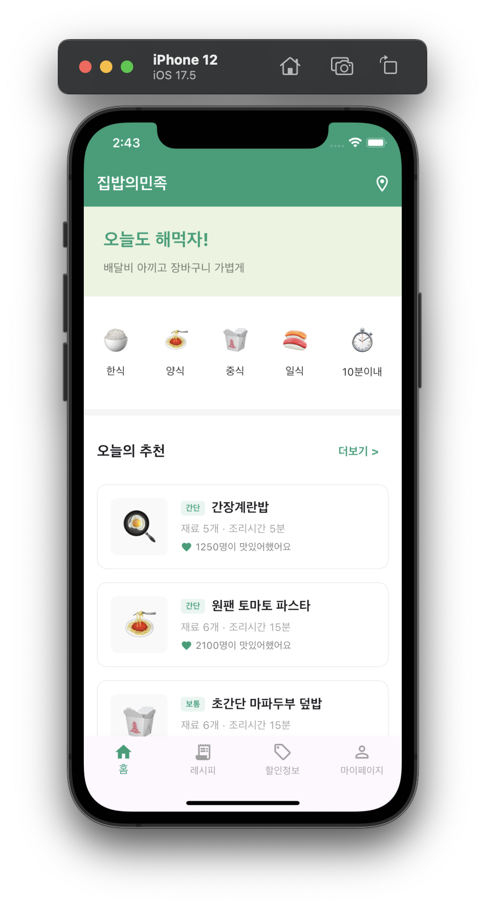
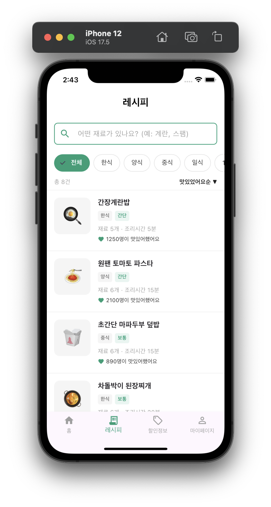
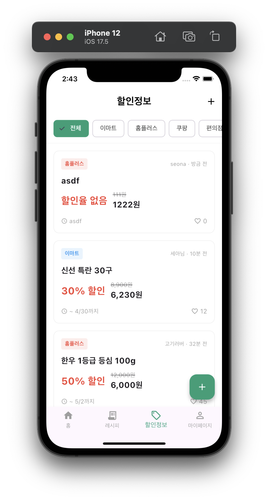
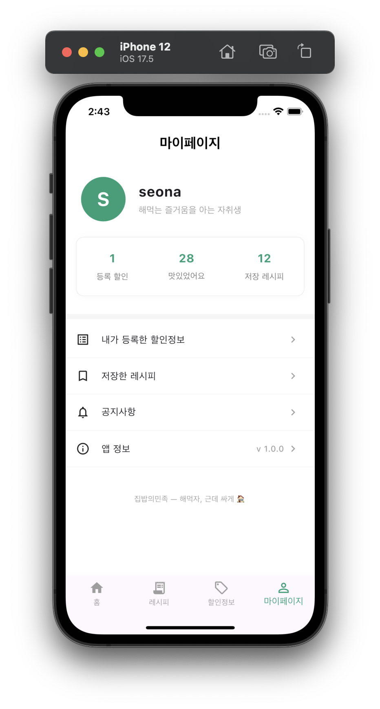

# 🏠 집밥의민족

> **해먹자, 근데 싸게** — 배달 대신 집밥, 재료도 알뜰하게

학번: 20200016
이름: 안선아

---

## 📱 프로젝트 개요

**집밥의민족**은 물가 상승으로 배달비 부담이 커진 대학생을 위한 집밥 레시피 & 식재료 할인정보 공유 앱입니다.

배달의민족 UI/UX를 패러디하여, 익숙한 인터페이스 안에 "해먹는 즐거움"을 담았습니다.
"주문하기" 대신 "지금 만들기", 음식점 목록 대신 레시피 목록 — 배달앱처럼 생겼지만 지갑은 훨씬 가볍습니다.

### 기획 배경
- 최근 배달비·외식비 급등으로 대학생의 식비 부담 증가
- '거지맵' 등 절약 트렌드가 MZ세대 사이에서 확산
- 집밥을 해먹고 싶어도 레시피 탐색 + 장보기 할인 정보를 따로 찾아야 하는 불편함

---

## ✨ 주요 기능

### 1. 레시피 추천
- 한식 · 양식 · 중식 · 일식 · 10분 이내 카테고리 필터
- 재료 수, 조리시간, 난이도 기반 필터 및 정렬
- 레시피 상세 페이지: 재료 목록 + 단계별 조리 순서
- "맛있었어요" 버튼으로 인기 레시피 확인

### 2. 식재료 할인정보 커뮤니티
- 사용자가 직접 주변 마트·플랫폼 할인 정보 등록
- 이마트 · 홈플러스 · 쿠팡 · 편의점 등 필터
- 할인율 자동 계산, 유효기간 표시
- 좋아요로 신뢰도 높은 정보 상단 노출

---

## 🛠 기술 스택

| 항목 | 내용 |
|------|------|
| Framework | Flutter |
| Language | Dart |
| 상태관리 | setState |
| 플랫폼 | iOS / Android |

---

## 📂 화면 구성

| 화면 | 설명 |
|------|------|
| 스플래시 | 앱 시작 로딩 화면 |
| 홈 | 카테고리 + 오늘의 추천 레시피 |
| 레시피 목록 | 검색 · 필터 · 정렬 기능 |
| 레시피 상세 | 재료 목록 + 조리 순서 + 지금 만들기 |
| 할인정보 | 사용자 등록 할인 피드 |
| 할인정보 등록 | 마트 · 품목 · 가격 · 기간 입력 폼 |

---

## 🙋 본인이 구현한 부분

- 전체 화면 기획 및 UI 구성
- 앱 브랜딩 (컬러 시스템, 로고, 슬로건)
- 스플래시 스크린
- 홈 화면 레이아웃 및 카테고리 필터
- 레시피 목록 화면 (검색바, 필터 칩, 카드 리스트)
- 레시피 상세 화면 (재료 목록, 조리 순서, 맛있었어요 기능)
- 할인정보 화면 (마트별 필터, 카드 리스트, 좋아요)
- 할인정보 등록 화면 (입력 폼, 할인율 자동 계산)
- 하단 네비게이션 바 연결

---

## 🤖 AI 활용 여부 및 활용 범위

본 프로젝트는 **바이브 코딩(Vibe Coding)** 방식을 적극 활용하였습니다.

| 활용 도구 | 활용 내용 |
|-----------|-----------|
| Claude (Anthropic) | 앱 기획 · 아이디어 구체화 · 브랜딩 방향 설정 |
| Claude / Cursor | 각 화면별 Flutter 코드 생성 (프롬프트 기반) |

- 화면별로 상세한 프롬프트를 직접 작성하여 코드 생성
- 생성된 코드를 검토·수정하며 앱에 통합
- 브랜딩 컨셉(배달앱 패러디, 컬러 시스템, 슬로건)은 직접 기획

---

## 📄 라이선스

```
MIT License

Copyright (c) 2026

Permission is hereby granted, free of charge, to any person obtaining a copy
of this software and associated documentation files (the "Software"), to deal
in the Software without restriction, including without limitation the rights
to use, copy, modify, merge, publish, distribute, sublicense, and/or sell
copies of the Software, and to permit persons to whom the Software is
furnished to do so, subject to the following conditions:

The above copyright notice and this permission notice shall be included in
all copies or substantial portions of the Software.

THE SOFTWARE IS PROVIDED "AS IS", WITHOUT WARRANTY OF ANY KIND, EXPRESS OR
IMPLIED, INCLUDING BUT NOT LIMITED TO THE WARRANTIES OF MERCHANTABILITY,
FITNESS FOR A PARTICULAR PURPOSE AND NONINFRINGEMENT.
```

---

## 💰 수익 모델 (향후 계획)

### 1. 쿠팡 파트너스
- 레시피 재료 및 할인정보 카드에 "쿠팡에서 구매" 버튼 연동
- 사용자가 버튼 클릭 후 구매 시 수수료 수익 발생 (3~5%)
- 식재료 검색 URL 자동 연결

### 2. Google AdMob
- 앱 내 배너 광고 삽입
- 레시피 목록, 할인정보 화면 하단에 광고 배치
- 노출/클릭 기반 수익 발생

---

## 📸 실행 화면

| 홈화면 | 레시피 | 할인정보 | 마이페이지 |
|--------|--------|----------|------------|
|  |  |  |  |

---

*집밥의민족 — 배달 말고 해먹자, 근데 싸게* 🏠🍳
